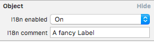
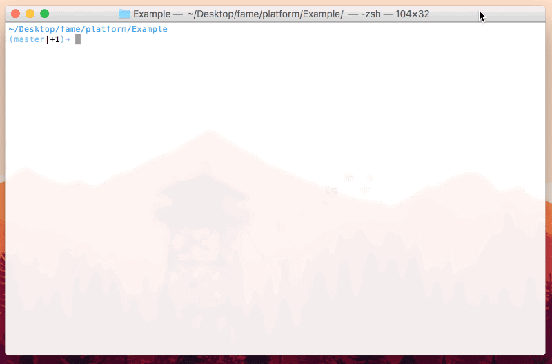
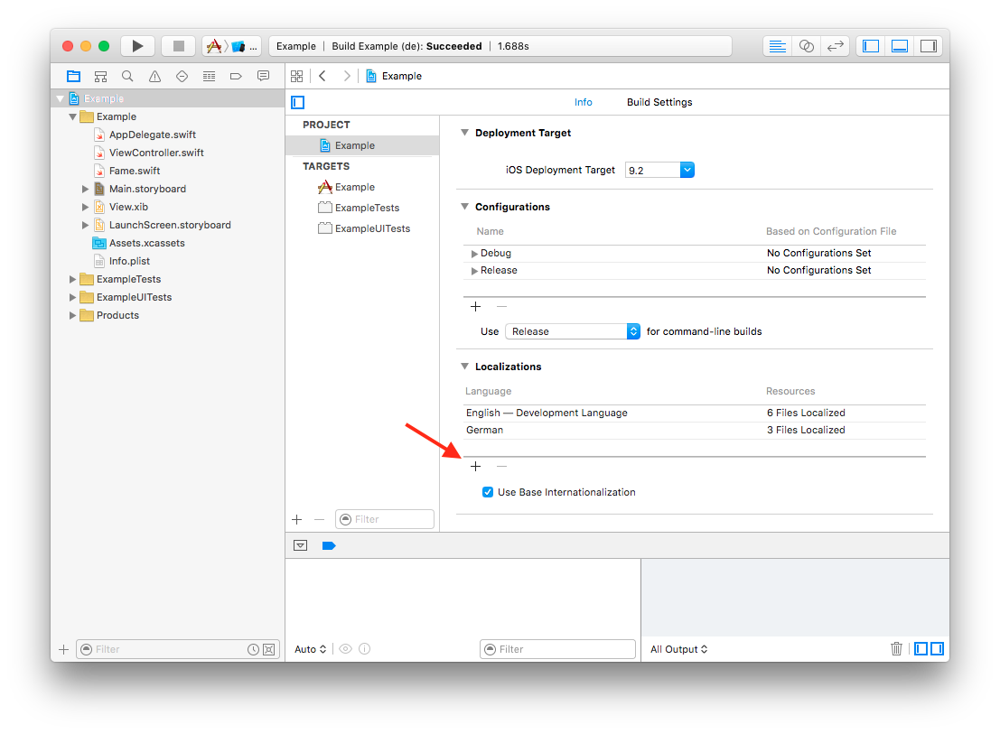
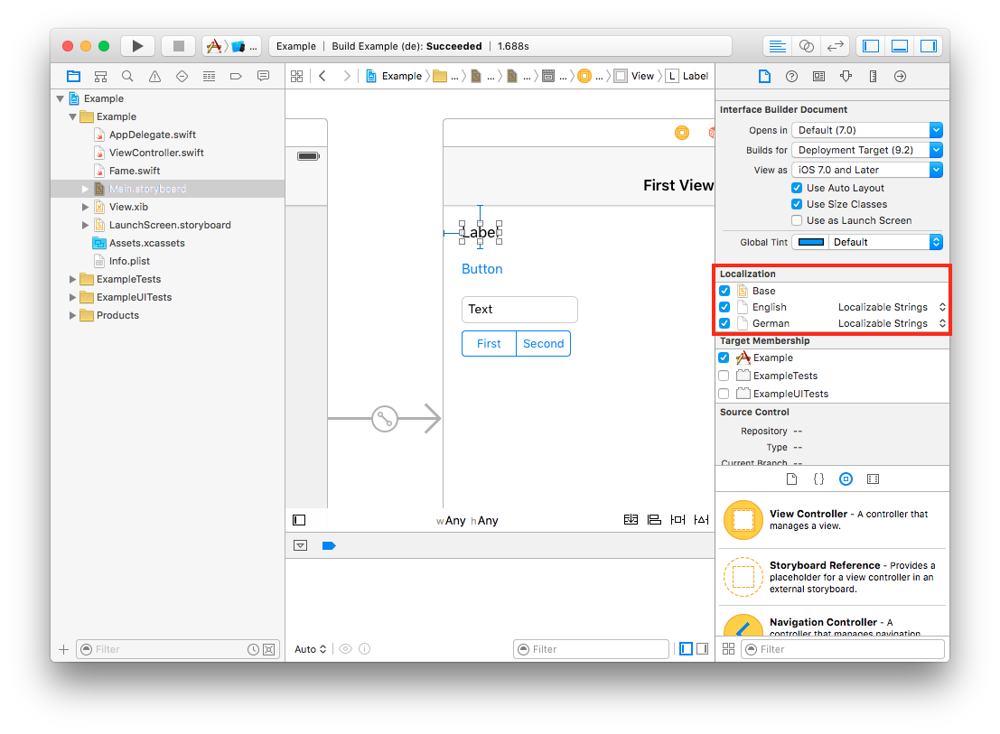
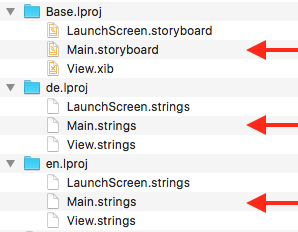
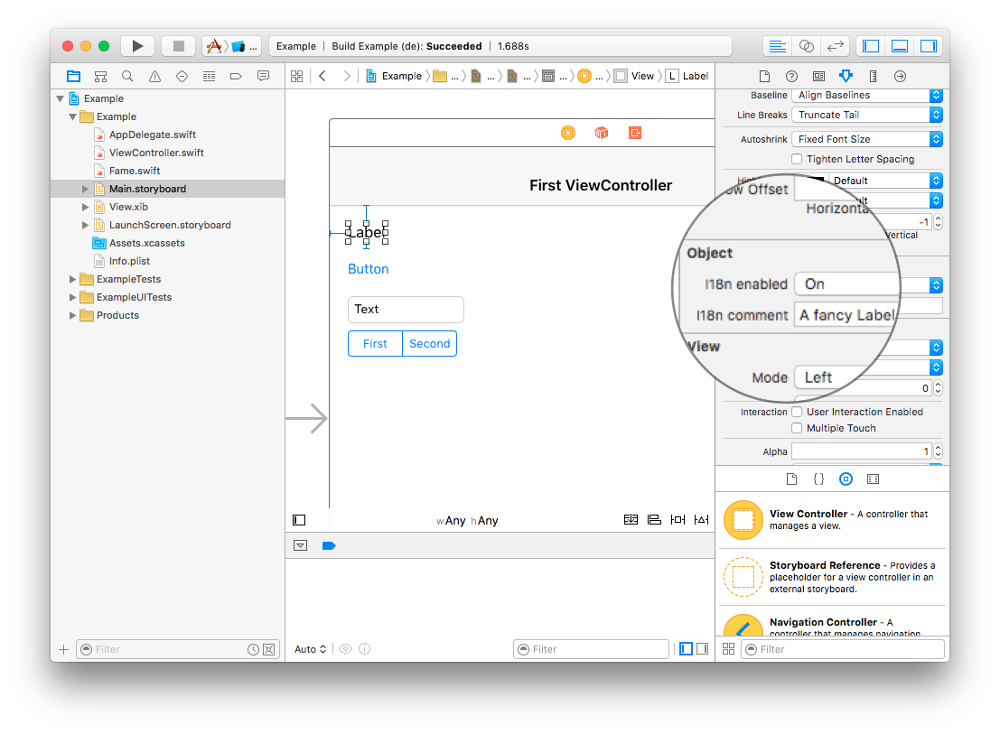

Delightful localization of .storyboard and .xib files, right within Interface Builder.
Fame makes it exceptionally easy to enable _specific_ UI elements to be translated and exported to localizable .xliff files.

-----

<p align="center">
  <a href="#introduction">Introduction</a> &bull;
  <a href="#fame-features">Fame Features</a> &bull;
  <a href="#installation">Installation</a> &bull;
  <a href="#usage">Usage</a>
</p>

-----

**TL;DR - Get started in less than 50 seconds.**

* Add languages to your Xcode project
* Add [Fame.swift](platform/Fame.swift) file to your project
* Open a storyboard or XIB file
* Enable or disable UI elements that should be localized within attribute inspector
* run `fame --project /path/to/Example.xcodeproj` from the root of your project
* Use the generated .xliff files to manage translations
* 🚀


## Introduction

Compared to localization in code (i.e. `NSLocalizedString`), Storyboard and XIB localizations are a tedious task for both developers and translators.
Here's why.

#### Static vs. dynamic localization

Storyboard and XIB files usually contain a mixed set of elements with *static* or *dynamic* text:
* **Static text**: Elements with fixed localization strings that will never change at runtime
* **Dynamic text**: Elements that will change their localized text during runtime. For example a label that is populated with data from an API or a status label that is populated using `NSLocalizedString` at runtime.

<!--  -->

**Static text elements should be localized, dynamic text elements should be ignored during translation.**

However, generated Storyboard and XIB translations also contain dynamic text localizations that will always be overridden at runtime. This makes it hard to distinguish between localizations that should be translated and dynamic text that can be safely ignored during translation.
It's up to the app developers to either manually remove generated localizations that should not be translated, or leave them for the translators to waste their time with.

#### Localization comments

Storyboard and XIB .stings files generated by Xcode **do not provide a useful comment that provides context to the translator**.

```xml
<trans-unit id="si2-WH-Hr5.text">
  <source>A fancy Label</source>
  <target>A fancy Label</target>
  <note>Class = "UILabel"; text = "A fancy Label"; ObjectID = "si2-WH-Hr5";</note> <-- This is not so helpful 🙄
</trans-unit>
```

Translators use this comment to make sure their translation fits into the context it is used in. Its again up to the app developers to either manually search for specific translations and add a comment, or leave let the translators figure out how to find the best translation without context.


## Fame Features

Fame solves the above mentioned issues to help developers and translators get the most out of tedious localization tasks.

#### Integrated into Interface Builder

Fame makes it easy for developers to specify which elements of your Storyboard and XIB files should be translated, all right within interface builder. Developers may also add a comment for each element to provide additional context to  translators.



#### Command Line Interface

Using the fame CLI, developers can export .xliff files that only contain localizations for elements previously enabled in Interface Builder.



#### Generates beautiful .xliff files

Translators only receive the strings that should actually be translated, saving them time (and you potentially lots of money). All generated .xliff files also contain each element's name and a useful comment to provide more context by the app developer.

```xml
<trans-unit id="si2-WH-Hr5.text">
  <source>A fancy Label</source>
  <target>A fancy Label</target>
  <note>Explains to the customer how to purchase a pro subscription. Make it catchy.</note> <-- Ahh, much better 😍
</trans-unit>
```

## Installation

Install the fame ruby gem using your terminal to get access to the fame command line interface.

```bash
$ gem install fame
```

#### Enable localization for Interface Builder files

> **Note**: You may skip to the next section if you have already setup your project and Interface Builder files for localization.

First off, add all supported languages to your project. This can be done by clicking the + button under your project's Localizations configuration. Go ahead and add as many languages as you want.



Next, make sure to enable localization for your Interface Builder files and choose the "Localizable Strings" option from the dropdown.



You should now have a Base Interface Builder file (e.g. `Main.storyboard`) in a `Base.lproj` folder and multiple localizable strings files (e.g. `Main.strings`) each within a language folder (e.g. `en.lproj` and `de.lproj`).



That's it, read on to enable fame for localization.

#### Setup [Fame.swift](platform/Fame.swift) Interface Builder integration

In order to enable the Interface Builder integration to specify the elements that should be translated, add the **[Fame.swift](platform/Fame.swift)** file to your Xcode project. To test the Interface Builder integration, open any Interface Builder file in your project, select an element (e.g. a UILabel) and you should see a new section that lets you configure localization for this element in the Attributes inspector.



You can now enable localization for each element you want to have translated.

## Usage

Once all localizable elements have been configured in Interface Builder, you can export the localizable .xliff file using the `fame` command line tool.

First, make sure to commit all local changes, just to be safe. Then open terminal, navigate to the root folder of your project and run

```bash
$ fame --project Example.xcodeproj [--ib-file-path] [--output-path]
```

In a nutshell, the fame command does the following:

* Analyze the given Xcode project file for supported languages
* Find all .storyboard and .xib files in the `--ib-file-path` (recursively, you may pass a file or folder, defaults to the current directory)
* Analyze each Interface Builder file and extract the localization settings (set via the [Fame.swift](platform/Fame.swift) integration)
* Generate the full localizable .xliff file using Apple's `xcodebuild`
* Filter the `xcodebuild` output based on the analyzed localizable settings
* Update the generated .xliff with useful comments
* Save the clean .xliff files to `--output-path` (defaults to the current directory)

Enjoy 🍉

## Contributing

1. Fork it (https://github.com/aschuch/fame/fork)
2. Create your feature branch (`git checkout -b my-new-feature`)
3. Commit your changes (`git commit -am 'Add some feature'`)
4. Push to the branch (`git push origin my-new-feature`)
5. Create a new Pull Request

## Contact

Feel free to get in touch.

* Website: <http://schuch.me>
* Twitter: [@schuchalexander](http://twitter.com/schuchalexander)
